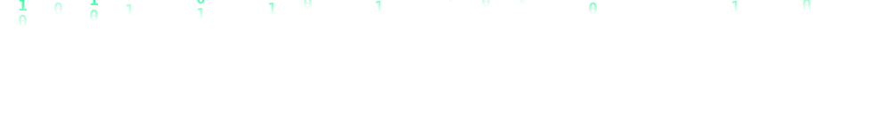
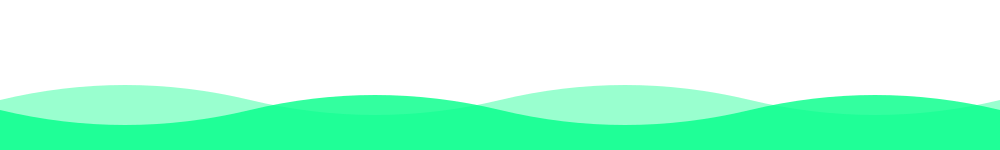

  
  <!-- Efeito Matrix Animado (Topo) -->
  
  
  <!-- Animação de digitação em verde neon -->
  
  
  
📍 <b>Itu/Sorocaba - SP</b>

   

  <!-- Janela do Terminal Animada -->
  

  
<i>Sou um educador apaixonado por tecnologia, atualmente focado em formar a próxima geração de desenvolvedores no <b>SENAI Sorocaba</b>. Minha trajetória une a experiência técnica em suporte e infraestrutura com a criatividade do desenvolvimento de sistemas e a metodologia do Design Thinking.</i>

 

  <h3>💼 No que eu trabalho atualmente</h3>
   

  <table>
    <tr>
      <td align="center" width="50%">
        <h3>🎓 Educação Profissional</h3>
        
Leciono sobre desenvolvimento de sistemas, cobrindo desde lógica de programação até arquiteturas complexas.

      </td>
      <td align="center" width="50%">
        <h3>🚀 <a href="https://www.fazbico.net/" target="_blank">Projeto FazBico</a></h3>
        
Plataforma SaaS para conectar prestadores de serviços locais via WhatsApp.

        
<b>Stack:</b> React, TypeScript, TailwindCSS e Supabase.

      </td>
    </tr>
  </table>

 

  <!-- Badges de Habilidades Animados / 3D -->
  <h3>🚀 Tecnologias e Ferramentas</h3>
  

    
  

   

  <!-- Cards de Status do GitHub com tema Dark/Neon -->
  

    <!-- Substituído para o Streak Stats devido à instabilidade do servidor anterior -->
    
  

    

  <!-- Links de Contato -->
  
  

    

  <!-- Contador de Visualizações do Perfil em Neon -->
  

    
  

   
  
  <h3><i>"Transformando lógica em solução e alunos em profissionais."</i></h3>

  <!-- Efeito Onda Animada (Rodapé) -->
  
  

